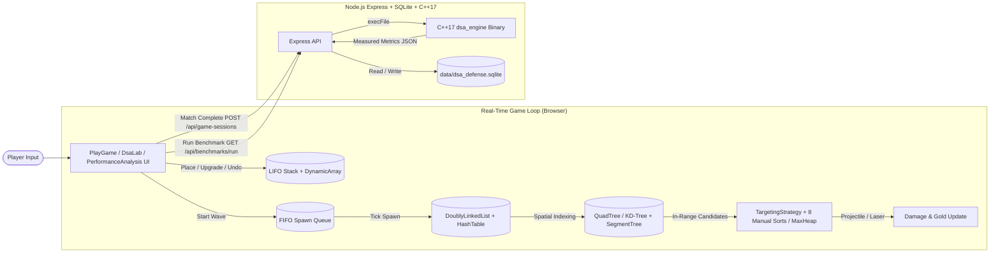

# Data-Flow Diagram (DFD) — Tower Clash

```mermaid
flowchart LR
  Player([Player Input]) --> UI[PlayGame / DsaLab / PerformanceAnalysis UI]

  subgraph Engine["Real-Time Game Loop (Browser)"]
    UI -->|Place / Upgrade / Undo| StackUndo[(LIFO Stack + DynamicArray)]
    UI -->|Start Wave| WaveQ[(FIFO Spawn Queue)]
    WaveQ -->|Tick Spawn| EnemyList[(DoublyLinkedList + HashTable)]
    EnemyList -->|Spatial Indexing| Spatial[(QuadTree / KD-Tree + SegmentTree)]
    Spatial -->|In-Range Candidates| Target[TargetingStrategy + 8 Manual Sorts / MaxHeap]
    Target -->|Projectile / Laser| Combat[Damage & Gold Update]
  end

  subgraph Backend["Node.js Express + SQLite + C++17"]
    UI -->|Match Complete POST /api/game-sessions| API[Express API]
    UI -->|Run Benchmark GET /api/benchmarks/run| API
    API -->|execFile| CPP[C++17 dsa_engine Binary]
    CPP -->|Measured Metrics JSON| API
    API -->|Read / Write| DB[(data/dsa_defense.sqlite)]
  end
```

