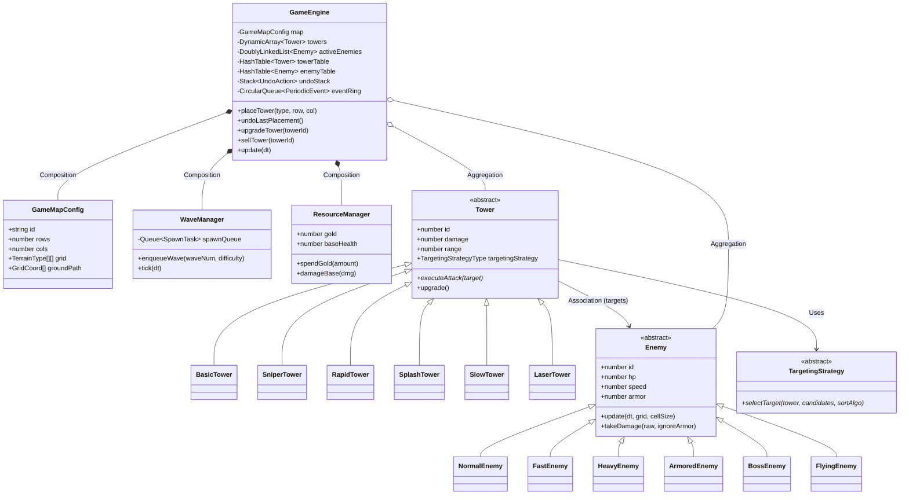

# UML Class Diagram — OOP Relationships

This diagram illustrates the object-oriented design in `src/engine/`, highlighting **Inheritance**, **Composition**, **Aggregation**, and **Association**.

```mermaid
classDiagram
  class GameEngine {
    -GameMapConfig map
    -DynamicArray~Tower~ towers
    -DoublyLinkedList~Enemy~ activeEnemies
    -HashTable~Tower~ towerTable
    -HashTable~Enemy~ enemyTable
    -Stack~UndoAction~ undoStack
    -CircularQueue~PeriodicEvent~ eventRing
    +placeTower(type, row, col)
    +undoLastPlacement()
    +upgradeTower(towerId)
    +sellTower(towerId)
    +update(dt)
  }

  class GameMapConfig {
    +string id
    +number rows
    +number cols
    +TerrainType[][] grid
    +GridCoord[] groundPath
  }

  class WaveManager {
    -Queue~SpawnTask~ spawnQueue
    +enqueueWave(waveNum, difficulty)
    +tick(dt)
  }

  class ResourceManager {
    +number gold
    +number baseHealth
    +spendGold(amount)
    +damageBase(dmg)
  }

  class Tower {
    <<abstract>>
    +number id
    +number damage
    +number range
    +TargetingStrategyType targetingStrategy
    +executeAttack(target)*
    +upgrade()
  }

  class BasicTower
  class SniperTower
  class RapidTower
  class SplashTower
  class SlowTower
  class LaserTower

  class Enemy {
    <<abstract>>
    +number id
    +number hp
    +number speed
    +number armor
    +update(dt, grid, cellSize)
    +takeDamage(raw, ignoreArmor)
  }

  class NormalEnemy
  class FastEnemy
  class HeavyEnemy
  class ArmoredEnemy
  class BossEnemy
  class FlyingEnemy

  class TargetingStrategy {
    <<abstract>>
    +selectTarget(tower, candidates, sortAlgo)*
  }

  GameEngine *-- GameMapConfig : Composition
  GameEngine *-- WaveManager : Composition
  GameEngine *-- ResourceManager : Composition
  GameEngine o-- Tower : Aggregation
  GameEngine o-- Enemy : Aggregation
  Tower --> Enemy : Association (targets)
  Tower --> TargetingStrategy : Uses

  Tower <|-- BasicTower
  Tower <|-- SniperTower
  Tower <|-- RapidTower
  Tower <|-- SplashTower
  Tower <|-- SlowTower
  Tower <|-- LaserTower

  Enemy <|-- NormalEnemy
  Enemy <|-- FastEnemy
  Enemy <|-- HeavyEnemy
  Enemy <|-- ArmoredEnemy
  Enemy <|-- BossEnemy
  Enemy <|-- FlyingEnemy
```

